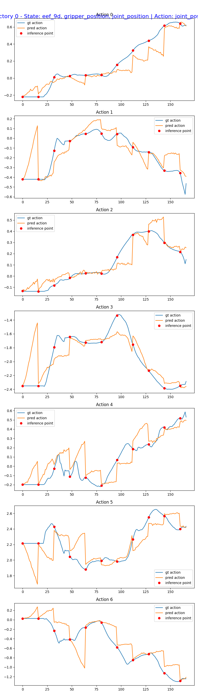

# GR00T inference spike

Run NVIDIA **Isaac GR00T N1.5** (generalist robot manipulation foundation model)
on our GPU droplet and get it to produce actions for a pick task — proving we can
drive a real robot foundation model, not just our own small policy.

## Infra
- DigitalOcean droplet, **NVIDIA L40S (48 GB)**, Ubuntu 22.04, CUDA driver 590.
- Host + key are in the repo `.env` (`DO_DROPLET_HOST`, `DO_SSH_KEY_PATH`); gitignored.

```bash
HOST=root@$DO_DROPLET_HOST        # from .env
ssh -i $DO_SSH_KEY_PATH $HOST
```

## Setup (one-time, on the droplet)
`setup_droplet.sh` installs Miniconda, clones Isaac-GR00T, makes a py3.10 env,
installs GR00T + flash-attn. It runs in a tmux session so it survives disconnects.

```bash
scp -i $DO_SSH_KEY_PATH groot/setup_droplet.sh $HOST:~/
ssh -i $DO_SSH_KEY_PATH $HOST 'tmux new -d -s groot "bash ~/setup_droplet.sh"'
ssh -i $DO_SSH_KEY_PATH $HOST 'tail -f ~/groot_setup.log'   # watch progress
```

## Inference
`run_inference.py` loads the GR00T N1.5 policy and runs it on a sample
observation (robot images + state + the language instruction), printing the
predicted action chunk. See that file for the exact command once setup finishes.

## Result ✅
GR00T N1.7 (3.14 B params) loaded on the L40S and, given a real DROID observation
(two camera views + robot state) conditioned on the instruction **"pick up the
can"**, predicted a **40-step action chunk**:

| head | shape | meaning |
|---|---|---|
| `eef_9d` | (1, 40, 9) | end-effector 9-D pose over the horizon |
| `gripper_position` | (1, 40, 1) | gripper open/close |
| `joint_position` | (1, 40, 7) | 7-DoF joint targets |

Evidence: [`inference_result.json`](inference_result.json), [`run_log.txt`](run_log.txt).

### Open-loop validation (predicted vs ground truth)
`eval_open_loop.py` runs GR00T open-loop across a real DROID episode and compares
its predicted actions to the **expert ground truth**:

- **joint MSE = 0.030, MAE = 0.119** ([`eval_result.json`](eval_result.json))
-  — across all 7 joints, GR00T's
  predicted trajectory (orange) tracks the expert (blue) over ~140 steps.

This is the "GR00T works *well*" artifact: the model's predictions are accurate,
not just well-formed.

## Gotchas hit (so the next run is one-shot)
1. **conda ToS** — recent Miniconda blocks env creation until channel ToS is
   accepted (`conda tos accept ...`). Handled in `setup_droplet.sh`.
2. **install order** — `flash-attn`'s build imports torch, so torch must be
   installed *first*; then the prebuilt flash-attn wheel (no source compile).
3. **CUDA 13 box** — torch 2.7 pins Triton 3.3.1, which doesn't know CUDA 13 →
   `scripts/patch_triton_cuda13.sh`.
4. **gated HF repos** — need access to **both** `nvidia/GR00T-N1.7-3B` *and* its
   backbone `nvidia/Cosmos-Reason2-2B` (accept terms on each page), plus `HF_TOKEN`.
5. **git-lfs** — the repo's `demo_data/` are LFS pointers; `git lfs pull`.
6. **ffmpeg** — torchcodec needs system FFmpeg libs (`apt install ffmpeg`).

## Notes
- Honest framing: this is a **spike** — proof that GR00T loads and infers on our
  infra and emits actions for our task. It is not (yet) wired into the live loop.
- CUDA toolkit on the box is 13.1; torch ships its own CUDA runtime, and we use a
  prebuilt flash-attn wheel, so the system nvcc version should not matter.
